# Hi there 👋
I'm Alexander, a **Java Backend Developer** and **Developer Experience Engineer** with a passion 
for software that solves problems and automates stuff, focused on building **automation systems and developer platforms**.
After completing my master's degree in Biology, I found that the systematic and curious mindset from science transfers perfectly into tech 
— both are about understanding complex systems and making them work better.
 

Today, I build tools that help developers ship with confidence and focus on creativity, not chaos.
> 💡 My mission: **Build developer platforms and automation systems that enhance human creativity, support sustainability, and integrate AI responsibly.**
---
## 🔭 Current Focus
- **Spring Boot APIs** with security, monitoring & database integration  
- **Dockerized deployments** for fast and reproducible dev environments  
- Building automation tools to enhance **developer experience**
- Exploring **responsible AI integration** into developer workflows  

---

## 💻 My Tech Stack:
<!--  -->

- **👨‍💻 Core:**
  
  

- **🌱 Backend Frameworks:**
  
  
  

- **🛢 Databases:**
  
  
  
  

- **⚙️ DevOps & Tools:**
  
  
  
  
  

- **🧠 Developer Experience:**
  
  
  
  
  
  
  
  
  
- **🏗️ IDEs:**
  
  
  
  

- **🎨 Design Tools:**
  
  
- **🔁 Focus Areas:**
Developer Experience • Automation • Platform Engineering • Python CLIs

🕰 Once Used / Familiar With

  
  
  
  
  
  
  
  
  
  
  
  
  
  

---

## 👨‍👧‍👦 Beyond Code  
I run **The Balanced Dad** — a small community helping fathers live *fit, free & focused* lives through health, mindset, and structure.  
Because great systems (and great lives) are both built with balance. 🌱  

📫 **Connect with me:**  
[LinkedIn](https://www.linkedin.com/in/alexanderblaschkosch%C3%A4nzer/) 
• [Twitter (X)](https://x.com/ActiveDadAlex) 
• [The Balanced Dad (skool)](https://www.skool.com/balanced-freedom-4587)
• [Email](mailto:alexander.blaschko@gmail.com)

---

## About Me
- 🔭 I’m currently working as a Java Backend Developer.
- 🌱 I’m passionate about agile methodologies and the evolving landscape of technologies.
- ⚡ Fun fact: When I'm not coding, you'll find me immersed in fantasy novels (or trying to write one myself), strumming away on my guitar, or pondering the intricacies of philosophy.

<!---  -->

---

Here, you'll find a collection of programming projects I've worked on, ranging from Java applications, over scripts 
and data science projects to web development ventures. Feel free to explore the code on [GitHub](https://github.com/AlexandersProjects) or dive into the summaries provided below.

## ✨Some of my past projects:
<!--🗄️ 🖇️ 📇 ✨ 🌟 -->

  
Show projects

<!--Template for a new project:

### [Porjectname (Languages/More Languages)](link_to_project)
Description

  
More details

  A bit longer description

#### Some screenshots from my application:

-->

<!-- Projects to add:

 -->

<!--Project: -->
### [Fullstack Issue Tracker (Javascript/Next.js/MySQL)](https://github.com/AlexandersProjects/fullstack-issue-tracker)
This is my Issue Tracker. It is still developing. Right now, it has a List of Users and a Navigation-Bar.

  
More details

  The goal is to have a completely running Issue Tracker comparable to GitHub running. 

  The core and planned features are:
  | Core     |      Advanced |
|:--------:|:-------------:|
| Creating an issue | User authentication |
| Viewing issues | Assigning issues |
| Updating an issue | Sorting issues |
| Deleting an issue | Filtering issues |
|  | Pagination |
|  | Dashboard |

#### My application:

<!--Project: -->
### Fullstack-Application (Java/Springboot/Angular/MySQL)
This is my fullstack application with Java and Angular. It is split up into frontend and backend:

#### [My Frontend Example (Angular))](https://github.com/AlexandersProjects/frontendbeispiel)

#### [My Backend Example (Java/Springboot)](https://github.com/AlexandersProjects/backendbeispiel)

  
More details

  I created this application as a possible starting point and as a reference for new projects. It`s running completely and works with MySQL.

#### My application:

<!--Project: -->
### [Todolist (Javascript/node.js/express.js/MongoDB)](https://github.com/AlexandersProjects/todolist-v2)
My Todo List application with Javascript, node.js, and express.js.

  
More details

  This is a Todo List application built with Node.js, Express, and MongoDB. It allows users to create, view, and delete tasks.

#### My application:

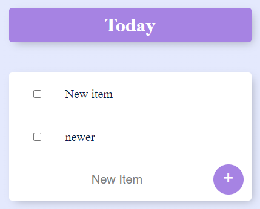

<!--Project: -->
### [Weather App (Node.js/React)](https://github.com/AlexandersProjects/WeatherProject)
This is my Weather application. 

  
More details

  Get your own API-Key (it's for free), run the application (1. node install, 2. node ./app.js), and you can check the weather on your own website!

#### Some screenshots from my application:
  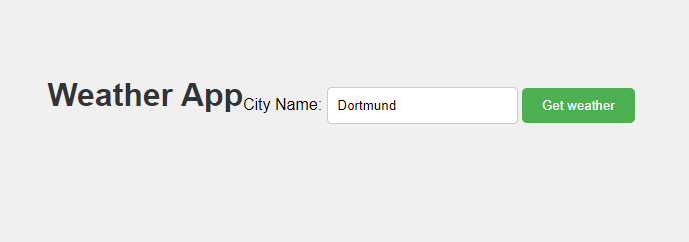
  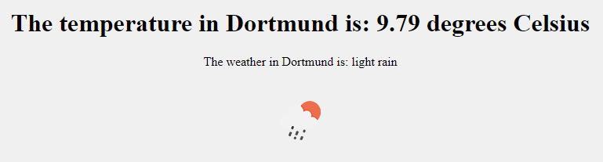

<!--Project: -->
### [My FreeCodeCamp Responsive Web Design Projects (HTML/CSS)](https://github.com/AlexandersProjects/ResponsiveWebDesignProjects_FCC)
This was my first complete Web Design course.

  
More details

I got my FreeCodeCamp Responsive Web Design Certificate! 
For this I went through the course (estimated 300 hours) and finished these 5 projects.

### This is my Certificate:
[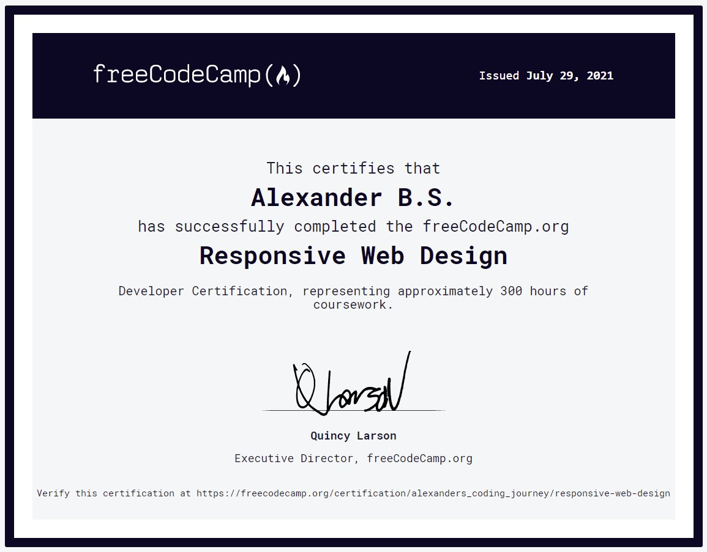](https://www.freecodecamp.org/certification/alexanders_coding_journey/responsive-web-design)

## And here are my creations:
### This is my Hulk Tribute page:
[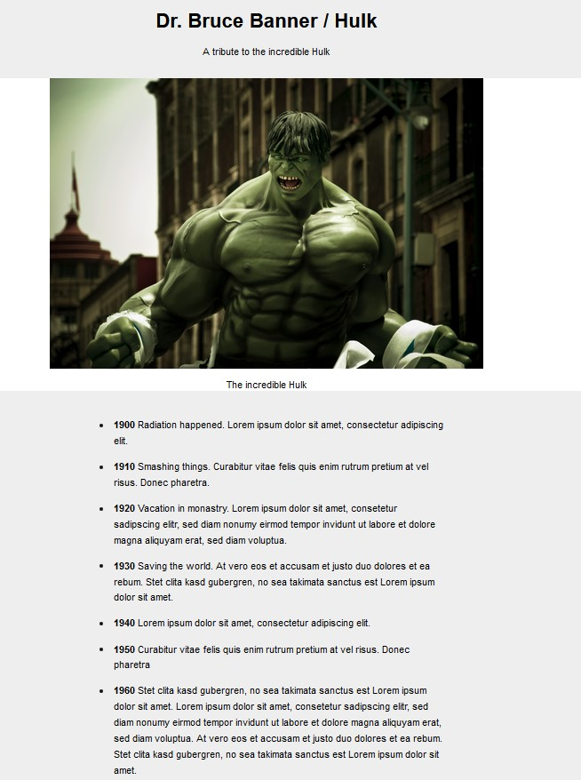](https://codepen.io/alexandersprojects/full/oNWqEOb)

### This is my Hulk-Fans Survey page:
[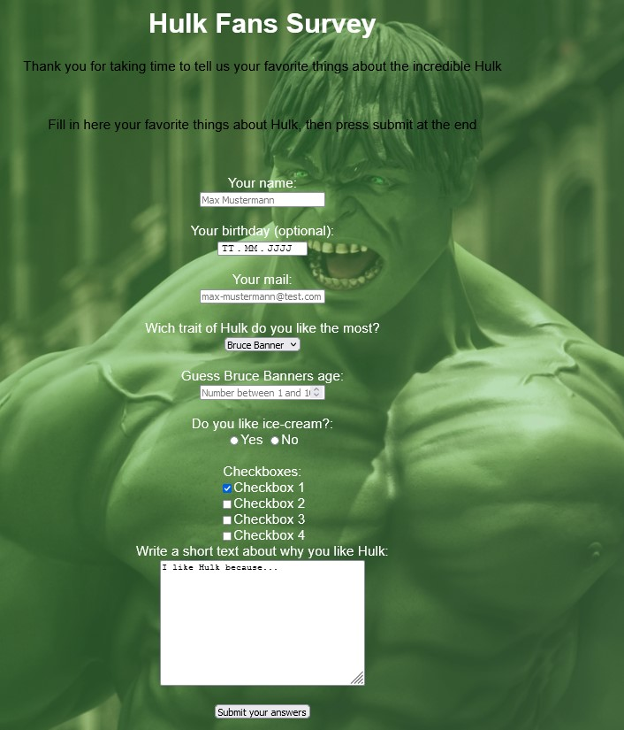](https://codepen.io/alexandersprojects/full/BaRrYem)

### This is my Hulk Landing page:
[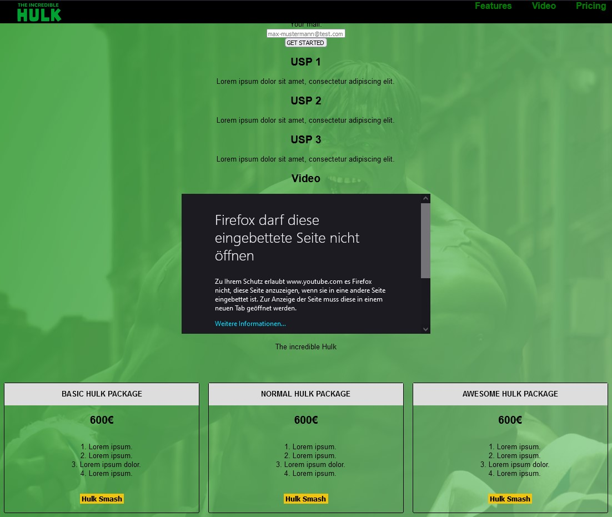](https://codepen.io/alexandersprojects/full/abWYqgo)

### This is my Fake Technical Documentation:
[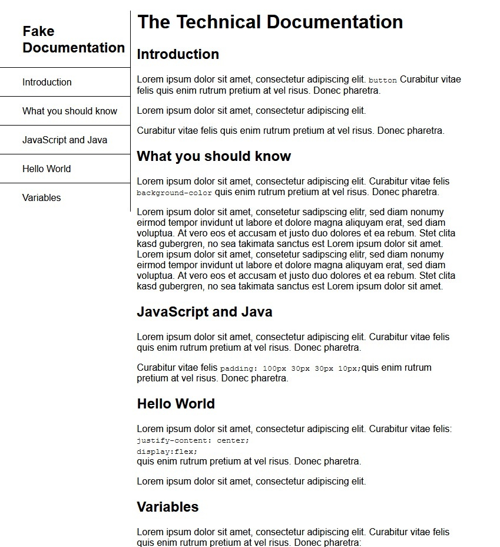](https://codepen.io/alexandersprojects/full/VwbXQJj)

### This is my Portfolio page:
[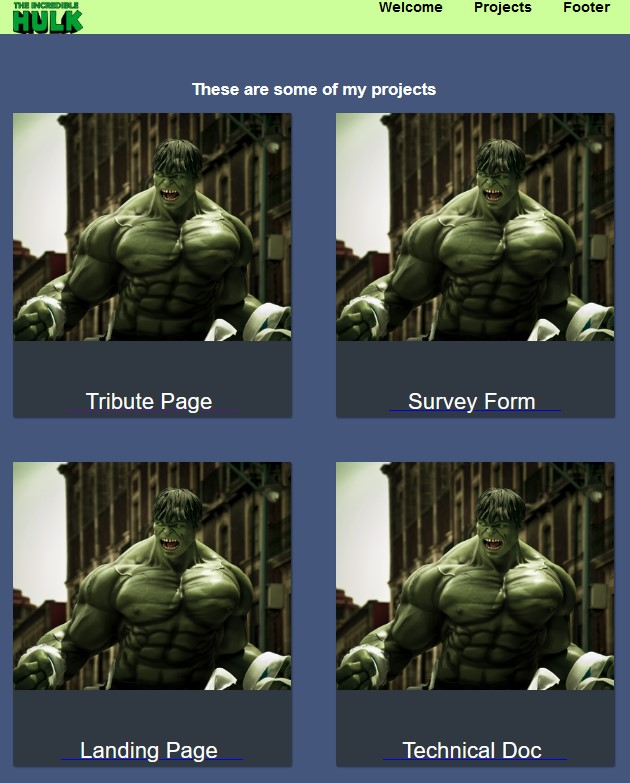](https://codepen.io/alexandersprojects/pen/QWvmQXx)

<!--Project: -->
# [First CSS Trials (HTML/CSS)](https://github.com/AlexandersProjects/pancake_recipe_website/tree/main)
Here, I updated my trial website and made a CatPhotoApp with HTML and CSS.

## Example output:
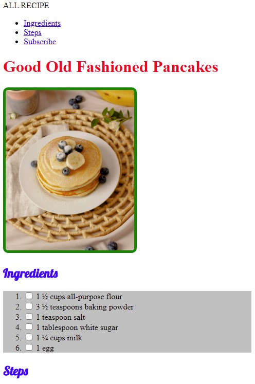
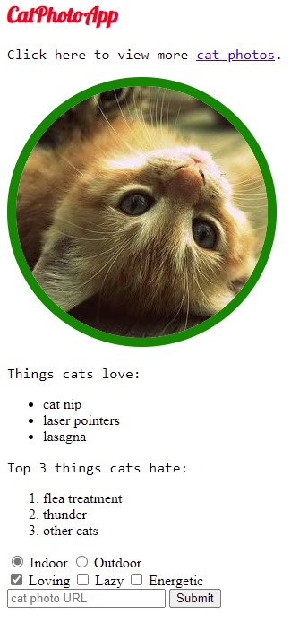

<!--Project: -->
# [First website in HTML (HTML)](https://github.com/AlexandersProjects/pancake_recipe_website/tree/main)
This is my first HTML Website.
I created a simple pancake recipe and experimented with some HTML code.

## Example output:

<!--Project: -->
### [ANOVA of tips (Python)](https://github.com/AlexandersProjects/ANOVA_python)
My ANOVA analysis with python of a freely available tips-dataset.

  
More details

* Explored the data
  * Boxplots
  * QQ-plots
  * Histograms
  * Used different R libraries for data exploration
* Controlled the data for outliers
* Compared if the total bills are statistically significantly different per weekday.

## Hypothesis

H1: The weekday has an effect on the amount of the total bill.
(M[1] != M[2] != M[3] != M[4])

H0: The weekday has no effect on the amount of the total bill.
(M[1] = M[2] = M[3] = M[4])

## Conclusion
### ANOVA
The weekday has a significant influence on the total bill (F(3, 240) = 2.767 , p = 0.0424). 3.34 % of the spread of the total sum can be explained by the weekday. According to Cohen (1988) is the effect size of 0.186 a small effect.

### Post-hoc-Test
The Bonferroni Post-Hoc-Test shows that no groups can be generalized out of the weekday (all p > 0.05). Thursday (M=17.68, SD=7.89, N=62), Friday (M=17.15, SD=8.30, N=19), Saturday (M=20.44, SD=9.48, N=87) and Sunday (M=21.41, SD=8.83, N=76) are not significantly different.

It can be concluded that no independent groups can be formed that differ from each other. Hence, although the ANOVA was significant, the H0 is kept and H1 declined.

## Example output:
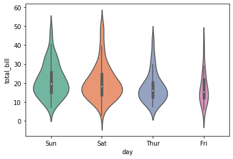
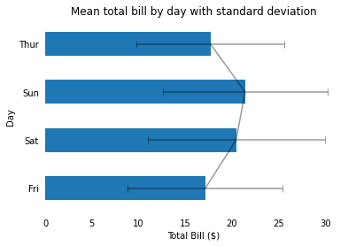

  <!--Project: -->
### [Statistical Exploration of tips (Python)](https://github.com/AlexandersProjects/stats_in_python)
My statistical exploration with python of a freely available tips-dataset.

  
More details

* Explored the data
  * Boxplots
  * QQ-plots
  * Histograms
  * Used different Python libraries for data exploration
* Controlled the data for outliers
* Used Pearson to check if there is a correlation between the total bill and the tip
* Compared if man and woman give significantly different tips.

## Conclusion
### Pearson
The tip and the total bill correlate positively significant (r = 0.6757341, p < 2.2e-16, n = 244). Hence, it can be said the higher the total bill the higher the tip. 45.66 % of the spread of the whole variance can be explained through the tip and the total bill. According to Cohen (1992) is the effect size of 0.68 a strong effect. The H0 can be discarded.

### T-Test
There is no significant difference between the tip of women (M = 2.83, SD = 1.16, n = 87) and man (M = 3.09, SD = 1.49, n = 157), (t(242) = -1.3879, p= 0.1665, n=244)). According to Cohen (1992) is the effect size of 0.185 no effect. The H0 cannot be discarded.

## Example output:
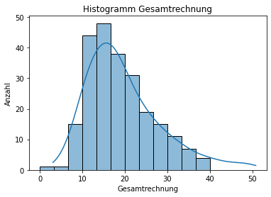
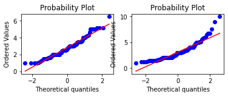

  <!--Project: -->
### [Freedom Status ANOVA (R)](https://github.com/AlexandersProjects/freedom_comparison_worldwide)
My statistical exploration with python of a freely available freedom-status-dataset.

  
More details

* Explored the data
  * Boxplots
  * QQ-plots
  * Histograms
  * Used different R libraries for data exploration
* Controlled the data for outliers
* Compared if the different Freedom status are statistically significantly different groups.

## Hypothesis

H1: There is a mean difference between degree of freedom and the relative GDP.
(FS[F] != FS[NF] != FS[PF])

H0: There is no mean difference between degree of freedom and the relative GDP.
(FS[F] = FS[NF] = FS[PF])

## Conclusion
### ANOVA
The degree of freedom has a signifikant influence on the relative GDP (F(2, 49.062) = 15.491 , p = 6.097e-06). 19.4 % of the variation in the relative GDP around the overall mean can be explained by the degree of freedom. The effect strength according to Cohen (1988) is f = 0.4907 and corresponds to a strong effect.

### Post-hoc-Test
The Tukey post-hoc-test shows, that two groups can be constructed according to degree of freedom (all p < .05): free (M = 27841401	, SD = 26632852, N = 56), and not-free (M = 12368148, SD = 18508685,N = 21) and partially-free (M = 6202767	, SD = 10345156, N=44) form the second group.

It can be concluded that two independent groups can be formed that differ from each other. Freedom is the most effective. H0 is declined, H1 accepted.

## Example output:
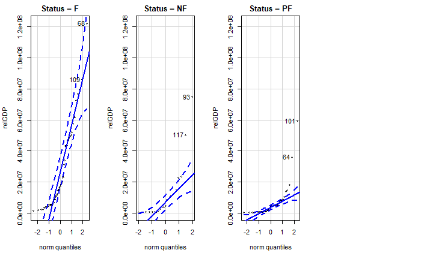
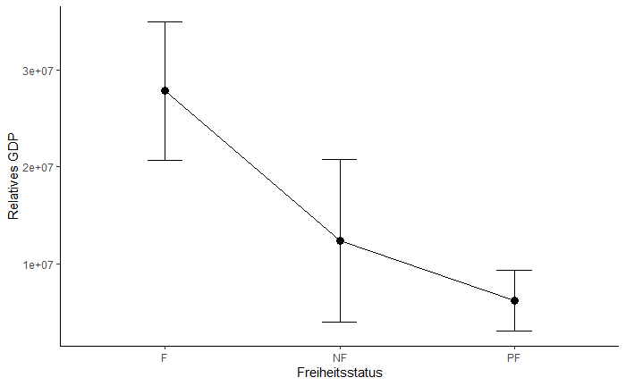

<!--Project: -->
### [Handwritten digits recognition (Python)](https://github.com/AlexandersProjects/ml_number_recognition)

  
More details

* Imported 20000 pictures
* Cleaned and reshaped the images
* Explored/ visualized the images
* Performed different prediction models:
  * Linear regression
  * Decision tree
  * Random Forest
  * Simple Neuronal Network
  * Try of convoluted Neuronal Network
* Tried different evaluation methods
  * Heatmap with errors
  * Loss over epochs
  * Accuracy

## Example output:
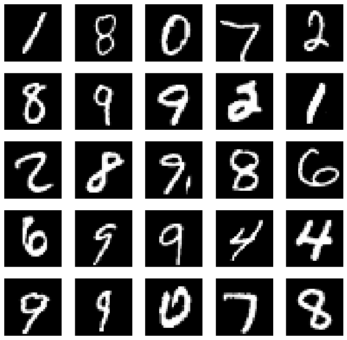
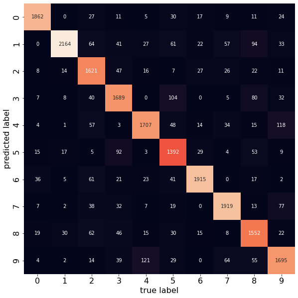

  <!--Project: -->
### [Pokemon comparison (R)](https://github.com/AlexandersProjects/legendary_pokemon_comparison)
In this project, I compared the legendary pokemon in R.

  
More details

* Explored the data
* Controlled the data
* Compared if legendary pokemon have statistically higher attack than non-legendary pokemon.

## Hypothesis

H0: The attack of legendary pokemon is lower or equal than of non-legendary pokemon.
(M[L] </= M[NL])

H1: The attack of legendary pokemon higher than of non-legendary pokemon.
(M[L] > M[NL])

## Conclusion
Legendary (M = 116.68, SD = 30.35, n = 65) pokemon have significantly higher attacks than non-legendary (M = 75.67, SD = 30.49, n = 735) pokemon (t(798) = -10.397, p = 2.513e-05, n= 798). Hence, the H0 can be discarded.
The effect-size is d = 3.438535 and is according to Cohen (1988) a very strong effect.

## Histrogram of pokemon attack:
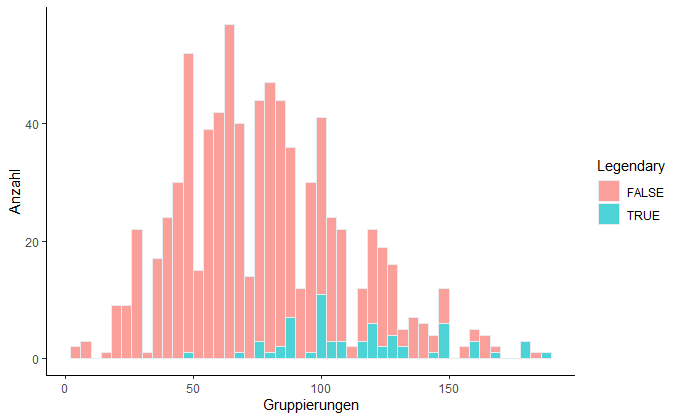

<!--Project: -->
### [Asteroid diameter prediction (Python)](https://github.com/AlexandersProjects/Asteroid_Diameter_Prediction)
In this project, I used machine learning for predicting asteroid diameter.

  
More details

  * Cleaned the data
* Explored the data
* Performed different prediction models:
  * Linear regression
  * Polynomial regressions
  * Decision tree
  * Random Forest

## Example output:

<!--Project: -->
### [Overfitting example (Python)](https://github.com/AlexandersProjects/ueberanpassung_Beispiele)
Here, I created different regressions and compared them.

  
More details

* Used pipelines
* Used convenience functions for calculations
* performed:
  * Linear regression
  * Quadratic regression
  * Cubic regression
* Made different plots

## Example output:
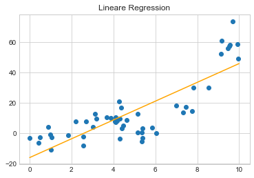
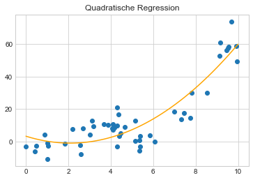
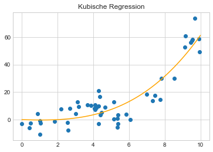

<!--Project: -->
### [Linear Regression (Python)](https://github.com/AlexandersProjects/linear_regressions)
Linear regressions are cool.

  
More details

* performed:
  * linear regression
  * multiple linear regression
  * polynomial regression
  * exploratory Data analysis
* Made different plots

## Example output:
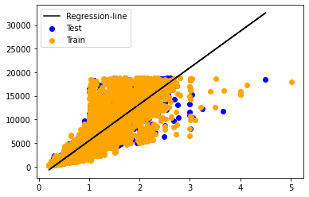

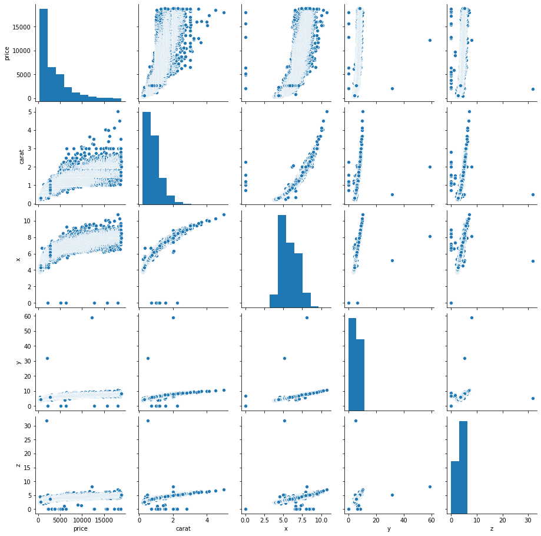

<!--Project: -->
### [SQL film festival database](https://github.com/AlexandersProjects/SQL_Filmfestival_Database)

  
More details

  
* I constructed a database from scratch
* I created all necessary tables
* I made all the necessary connections and indices
* I created views, procedures and triggers
* I made useful table and scalar functions

## The created database:
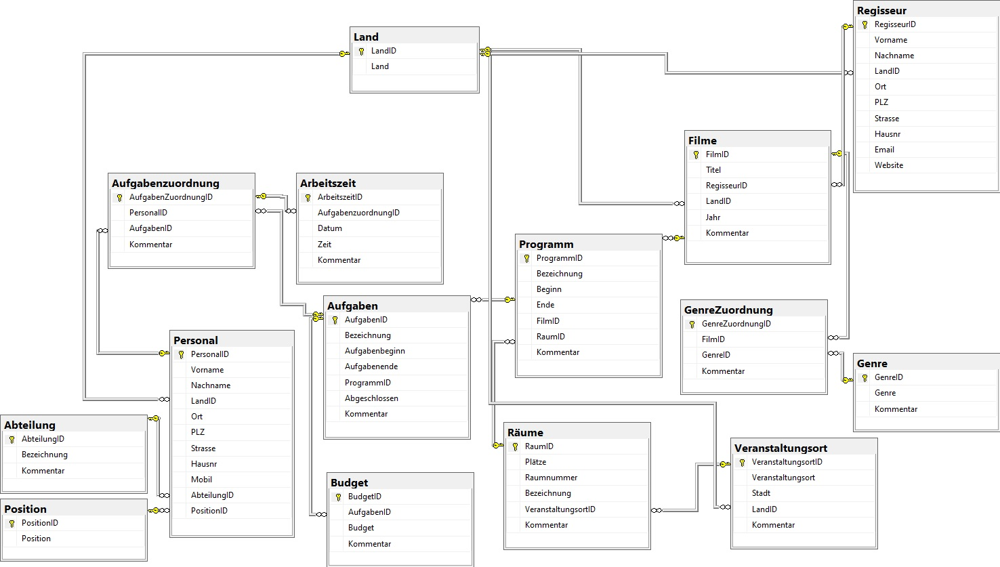

<!--Project: -->
### [Height and weight Dataset with OOP (Python)](https://github.com/CrazyShaddy/height_weight_analysis_and_prediction)

  
More details

  
* I scraped data from a website
* I explored the data
* I included everything in objects (OOP)
* I retained graphs from my classes
  * Sub plots
  * Regression line
* I made my first small prediction

## Created output:
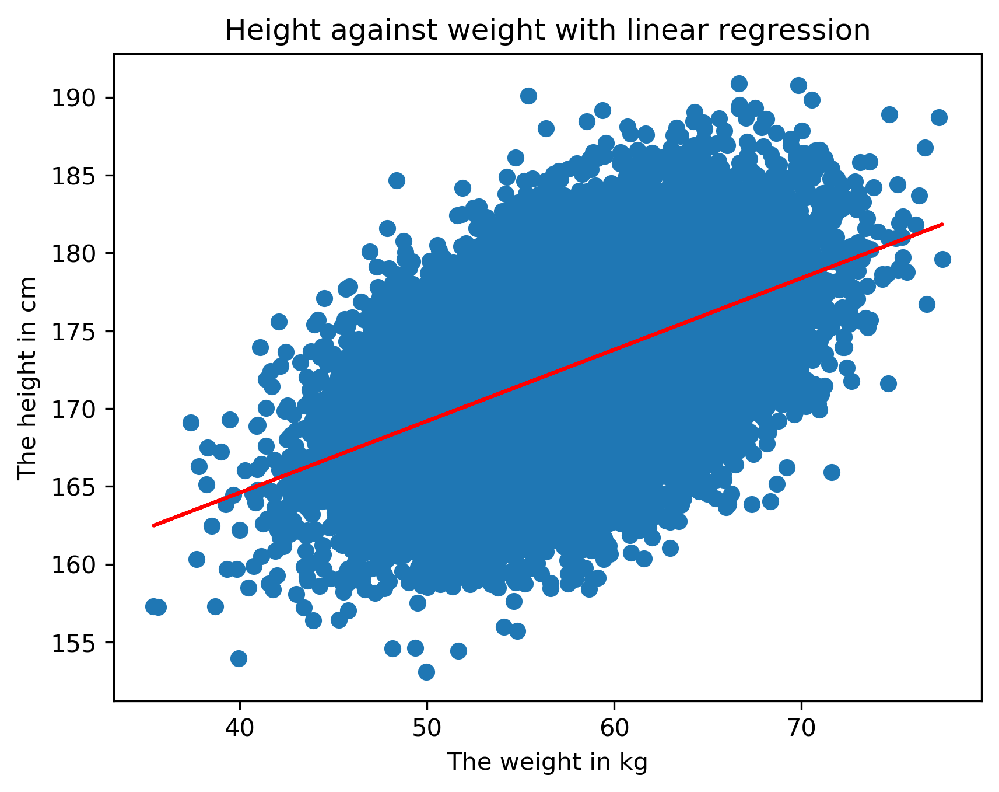
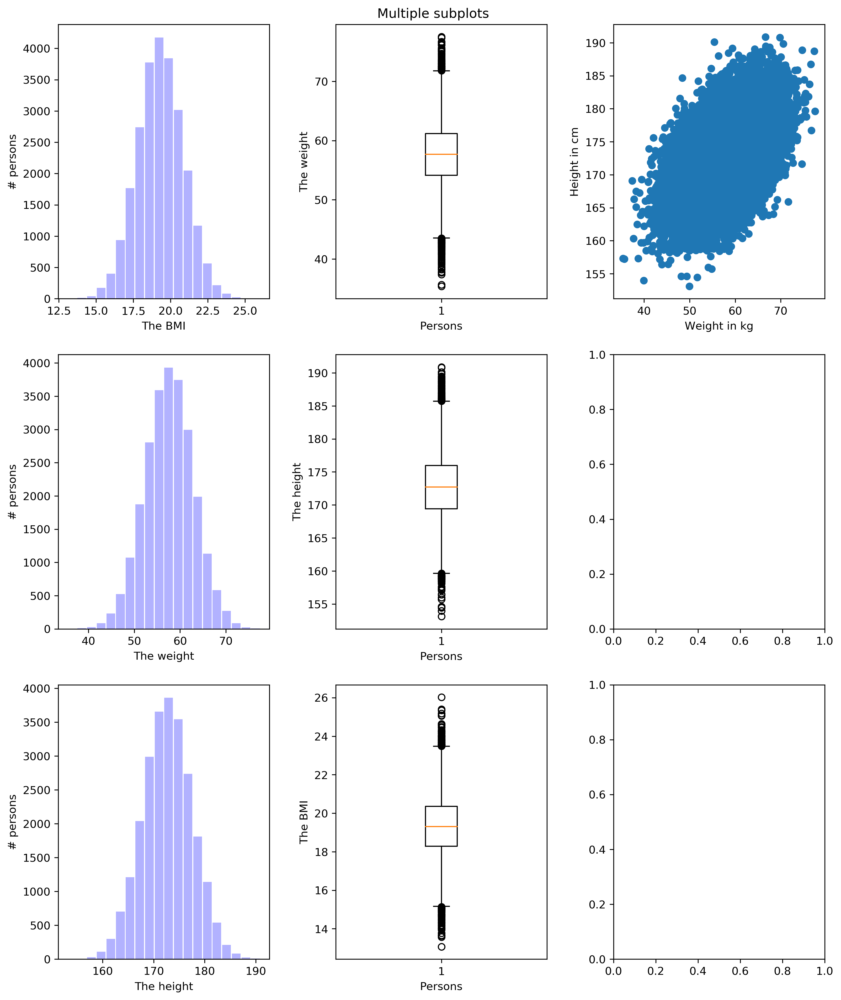
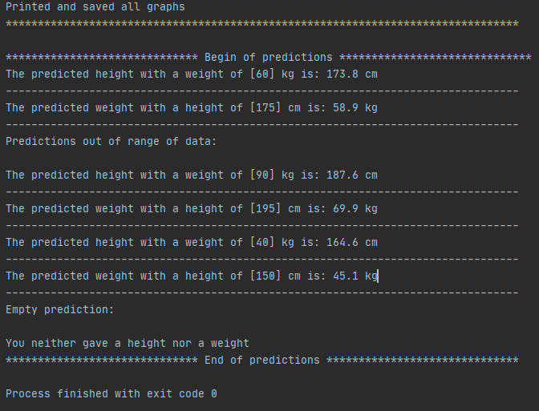

<!--Project: -->
### [Exploratory Data Analysis (Python)](https://github.com/CrazyShaddy/Exploratory-Data-Analysis)

  
More details

* I explored data from an online database
* I extracted different dataframes
* I merged important dataframes
* I made
  * Bar charts
  * Pie chart
  * Box plot
  * Sub plots
  * Different sub plots in one figure

## Created output:
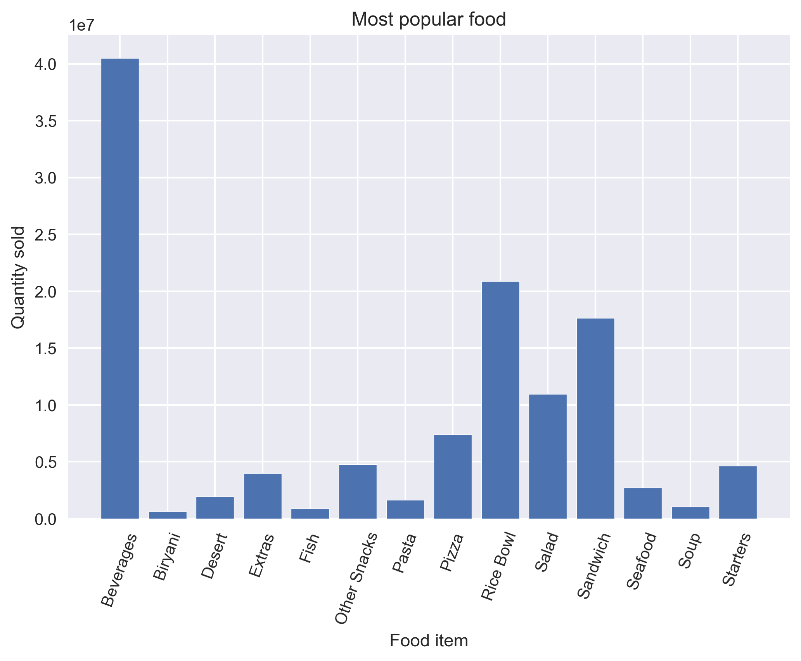

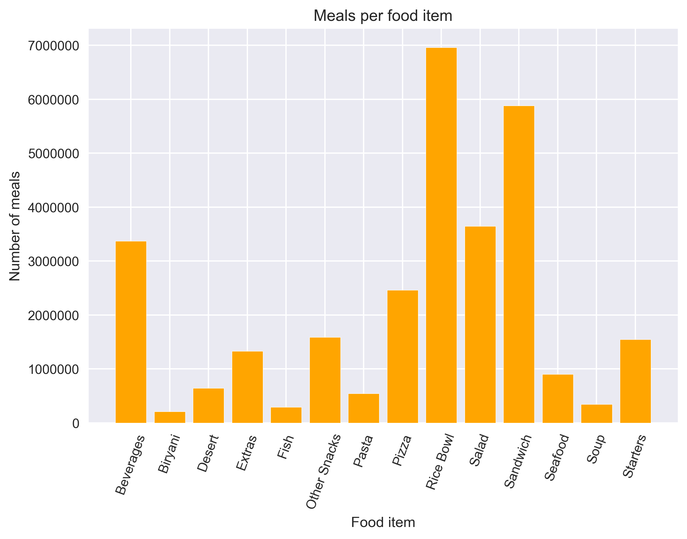

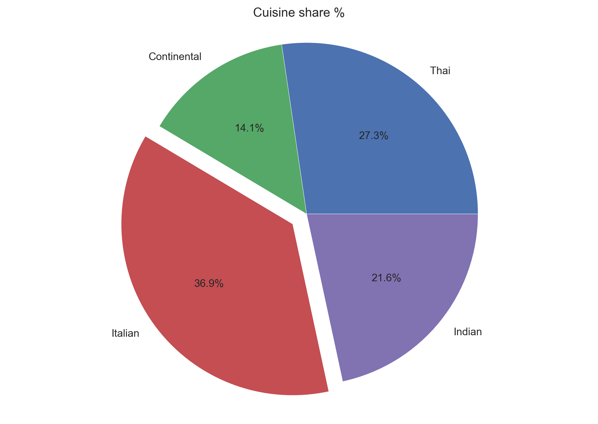

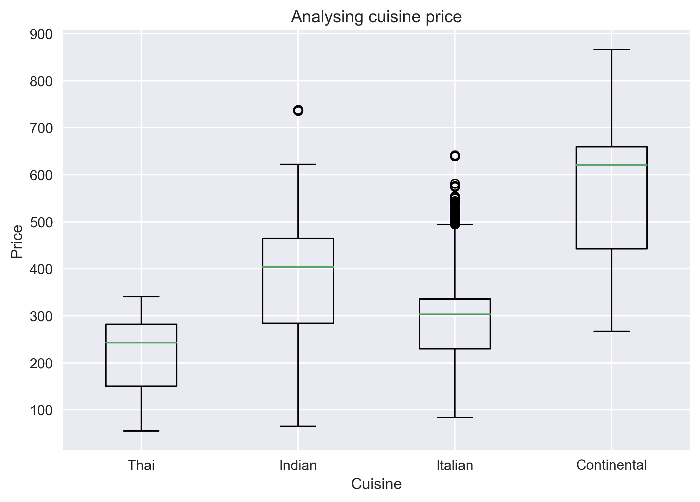

<!--Project: -->
### [Compound Interest calculator (Python)](https://github.com/CrazyShaddy/Compound_Interest_Calculator)

  
More details

* I made a calculator that calculates the compound interest and plots the graph from start till finish
* I took the user input
* I made functions to
  * retain the CI
  * save the x-values
  * calculate the compound interest
* I made lists for x- and y-values
* Finally, I plotted the graph with matplotlib

## Example output:

<!--Project: -->
### My first project
This was my very first project.

  
More details

  Surprise!
  Text me if you read this. Maybe you are the first one!

## 🏆 My Stats:

<a href="https://github.com/AlexandersProjects">
  
  
  <!-- Other themes: github_dark_dimmed, shadow_red, default, transparent -->
  <!-- 
  github-readme-stats-green-seven-42.vercel.app
  https://github-readme-stats-alexander-blaschko-schanzers-projects.vercel.app/
  -->
</a>

<!--  -->

[© GitHub-Readme-stats by anuraghazra](https://github.com/anuraghazra/github-readme-stats)

<!--  

-->